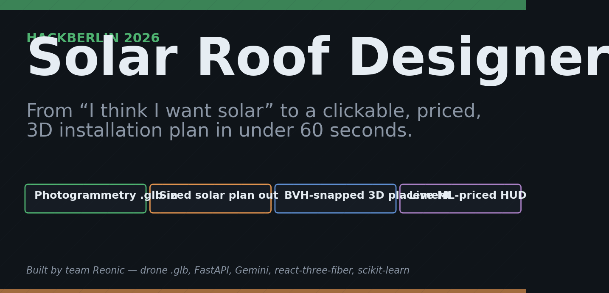
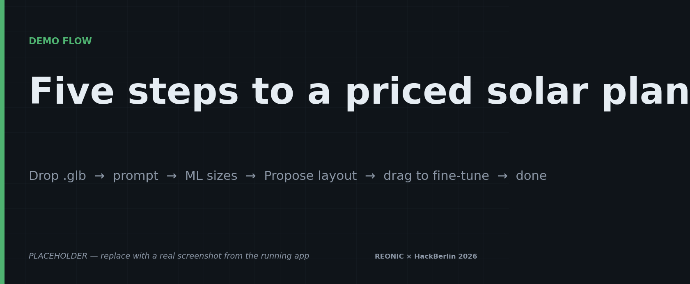
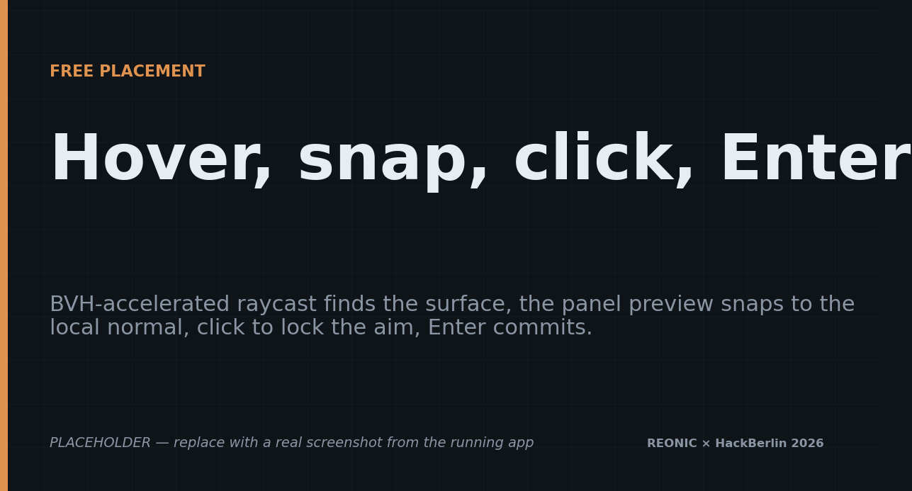
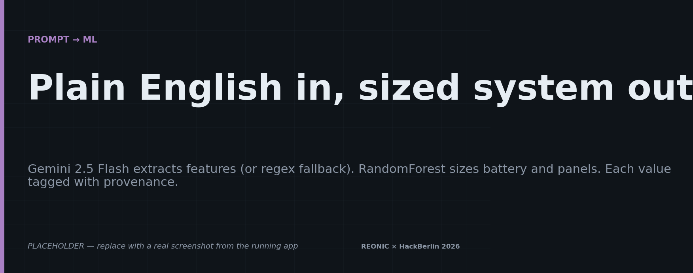
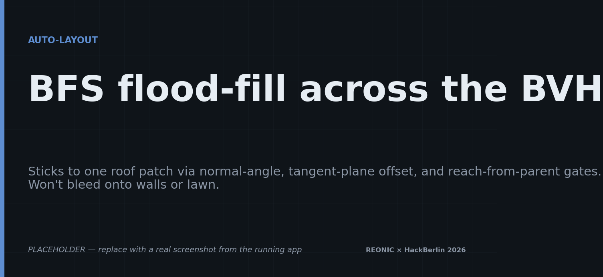
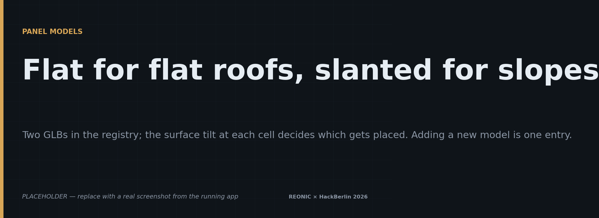
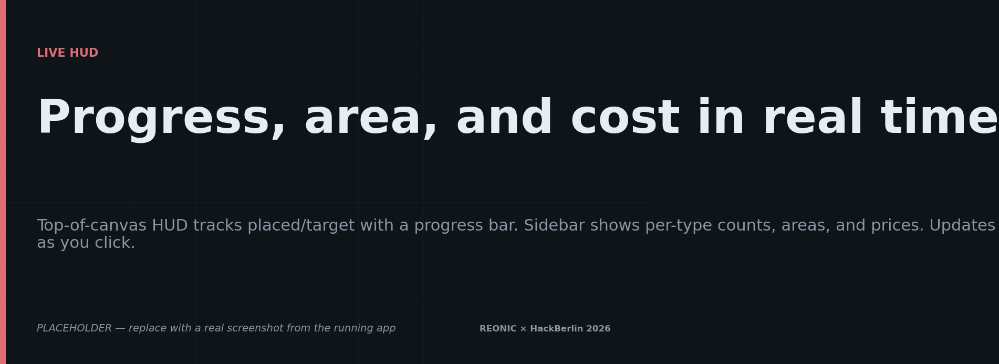
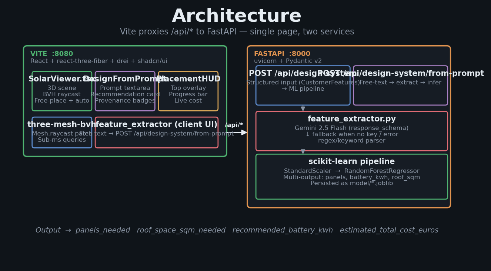

# Solar Roof Designer

> **From "I think I want solar" to a clickable, priced, 3D installation plan in under 60 seconds.**

A photogrammetry-aware web app that turns a sentence ("180 sqm house, two EVs, ~7 MWh/year, no solar yet") into a fully-sized solar + battery system, then lets you drag panels onto an actual 3D model of *your* roof — with surface snapping, slope-aware orientation, automatic flat-vs-tilt frame selection, and a live cost HUD.

Built at **HackBerlin 2026** in 36 hours.

<p align="center">
  
</p>

---

## Why this exists

Getting solar quoted is **slow and opaque**. You fill out a form, an installer comes out three weeks later, and you get a PDF with numbers that may or may not match your actual roof. Online "solar calculators" are even worse — they ask for your kWh consumption and spit out one number with zero spatial reality.

**We built the missing layer**: a tool where you can

1. **Describe your house in plain English** and have an ML model size the system,
2. **See it on your actual roof** by dropping a 3D scan into the canvas,
3. **Place panels by hand or auto-fill** with collision-free, slope-correct geometry, and
4. **Get a real-time price** that updates as you click.

The whole thing runs locally — drone-pipeline GLB in, panel layout out, no waiting for a sales rep.

---

## The 60-second demo

<p align="center">
  
</p>

| Step | Action | Result |
|------|--------|--------|
| **1** | Drop a `.glb` photogrammetry model into the canvas | The roof appears, indexed into a BVH for instant raycast queries |
| **2** | Type *"180 sqm house, two EVs, ~7 MWh/year"* into the prompt panel | Gemini extracts the features, the trained RandomForest sizes the system: **24 panels, 11 kWh battery, €23,210** |
| **3** | Toggle **Free Placement**, hover the roof | A translucent panel preview snaps to the surface and aligns to the local normal |
| **4** | Click **Propose a Design** | A BFS flood-fill across the BVH places exactly 24 panels on the same roof slope — no walls, no lawn |
| **5** | Drag any panel to fine-tune; the HUD updates the live cost in real time | Done |

Total time from "I have a screenshot of my house" to "here's a sized, priced, drawn-out plan": **under 60 seconds**.

---

## Features

### Drop a 3D model, place panels with hover-and-click

<p align="center">
  
</p>

- **BVH-accelerated raycasting** ([three-mesh-bvh](https://github.com/gkjohnson/three-mesh-bvh)). The loaded photogrammetry mesh is indexed into a Bounding Volume Hierarchy on load — every hover/click query stays at sub-millisecond latency regardless of polygon count.
- **Surface-normal alignment**. Each preview panel rotates so its local Z-axis aligns with the world-space face normal at the cursor — the panel "lies down" on the slope it's hovering over, no manual rotation needed.
- **Auto-orient X-axis horizontal**. The auto-orient code keeps the long edge of the panel along the eave direction by default, so panels look like a row of bricks instead of randomly tilted rectangles.
- **Click to aim, Enter to commit**. Clicks never instantly drop a panel — they only "lock" the preview at that position. A second `Enter` (or the Confirm button) commits. This is what kills the "I clicked on a placed panel and accidentally dropped a duplicate underneath it" bug that destroys most 3D editors.
- **Q / E / R hotkeys** rotate the preview ±15° and reset.

### Prompt → recommendation → reality

<p align="center">
  
</p>

- Free-text input at the top of the sidebar.
- **Gemini 2.5 Flash** extracts whichever fields it can confidently infer (energy demand, EV, wallbox, solar already installed, house size, electric heating). Uses Pydantic `response_schema` so the output is guaranteed to validate.
- **Regex fallback** activates automatically when no API key is present or Gemini hiccups — handles `kWh / MWh / Wh`, `m² / sqft`, EV / wallbox / solar / battery flags with negation (`"no EV"` is recognized), and the "EV charging at home → wallbox=1" implication.
- **Per-field provenance badges**: every value is tagged `extracted` (Gemini), `regex` (fallback), or `defaulted` (training-data median) so you know exactly what was inferred vs. assumed.
- The **trained RandomForest** (scikit-learn, ~1,100 real residential projects) maps the features to: `panels_needed`, `recommended_battery_kwh`, `roof_space_sqm_needed`, `estimated_total_cost_euros`. Multi-output regression with stratified train/test split, persisted as a joblib bundle.

### Auto-Layout (the "Propose a design" button)

<p align="center">
  
</p>

The hardest 3D problem in the project: given a seed point on the roof, place exactly N panels — without spilling onto walls, dormers, neighboring slopes, the lawn, or trees. We do it with a **BVH-accelerated breadth-first flood-fill**:

- Start at the seed cell, expand to 4-neighbors in the surface tangent plane.
- For each candidate cell, ray-cast straight along the seed's normal axis. Accept iff:
  - **(a)** The hit's face normal is within **12°** of the seed's — kills walls, dormers, neighbouring slopes.
  - **(b)** The hit point lies within **0.5 m** of the seed's tangent plane — *this* is what filters lawn from roof, even when both are flat.
  - **(c)** The hit is reachable from its parent cell within ~`max(stepU, stepV) × 1.25` metres — handles thin eave gaps where a ray would punch through to the ground beyond.
- Only accepted cells push their neighbours. Rejected cells become walls — the BFS stops at the eaves.

Each accepted cell gets the panel model (flat or slanted) appropriate to its own surface tilt. Result: a clean parallel layout that hugs the roof and stops where the roof stops.

### Two panel models, picked automatically

<p align="center">
  
</p>

| Model | When | Price |
|---|---|---|
| `solar_panel_flat.glb` | Horizontal surfaces (≤10° tilt — flat roofs, low-pitch garages) | €1,500/panel |
| `solar_panel_slanted.glb` | Pitched surfaces (with built-in tilt frame) | €1,700/panel |

The picker lives in one function (`pickPanelModel(worldNormal)`). The preview, the click-place handler, and the auto-layout all flow through `surfacePoseFromHit` so the same logic ships in three places without duplication. Adding a new model from Sketchfab is **one entry** in the `PANEL_MODELS` registry — the `Panel` component auto-fits the GLB to the physical dimensions via a Box3 measurement.

### Live HUD + per-type stats

<p align="center">
  
</p>

While free-placement is on and the ML target is loaded:

- **Top-of-canvas HUD** shows `placed / target`, a progress bar, and a live cost (battery base + per-panel × placed). Bar turns green when goal is met.
- **Sidebar "By panel type" card** shows count, dimensions, per-panel area, per-panel price, and subtotal — separately for flat and slanted units.
- **"Roof patch" card** (after pressing Measure or Propose) shows total slot count for the seed's contiguous roof patch, area available, area panels would cover, and slots remaining. Numbers update live as you place / delete panels.

### Manual flow for power users

For folks who'd rather drive it like CAD:

- **Coordinate Grid** — show the holographic grid, align it to the roof with pan/rotate/height sliders, click "Set Grid".
- **Cell-pick mode** — click individual grid cells; panels fill them on Confirm.
- **Add more solar panels** — append to a placement instead of replacing.
- **Per-panel controls** while holding a panel: arrow keys to rotate / lift, Backspace to delete, Shift-click for multi-select.
- **2D OBB collision detection** silently blocks any drag that would cause two panels to overlap.

---

## Architecture

<p align="center">
  
</p>

One page in the browser, two services on localhost. The Vite dev server forwards everything under `/api/*` to FastAPI on port 8000, so the same code paths run in dev as in prod.

---

## Tech stack

| Layer | What we used |
|---|---|
| **3D rendering** | React Three Fiber, Three.js, `@react-three/drei`, `three-mesh-bvh` |
| **UI** | React 18, TypeScript, Vite 8, Tailwind CSS, shadcn/ui, lucide-react |
| **ML serving** | FastAPI, uvicorn, Pydantic v2 |
| **ML model** | scikit-learn RandomForestRegressor (multi-output), StandardScaler, joblib |
| **NL extraction** | Google Gemini 2.5 Flash via `google-genai` SDK with Pydantic `response_schema`, regex fallback for offline use |
| **Data** | pandas, numpy on ~1,100 real residential project records |
| **Env** | python-dotenv, `.env` for `GEMINI_API_KEY` |

---

## Getting Started

### 1. Install

```bash
# Frontend
npm install

# Backend
python3 -m venv .venv && source .venv/bin/activate
pip install -r requirements.txt
```

### 2. Configure (optional — Gemini key)

Create `.env` in the project root (already gitignored):

```env
GEMINI_API_KEY=AIza...   # https://aistudio.google.com/app/apikey
```

If you don't set this, the regex fallback handles the demo prompts fine.

### 3. Run

Two terminals:

```bash
# Terminal 1 — ML backend (port 8000)
.venv/bin/python3 src/inference_server.py

# Terminal 2 — Frontend (port 8080, proxies /api → :8000)
npm run dev
```

Open <http://localhost:8080> and you're in.

---

## Project Structure

```
public/solar_panels/         GLB panel models (flat + slanted, preloaded)
assets/screenshots/          Hackathon screenshots for this README

src/
  components/
    SolarViewer.tsx          All 3D scene + placement + propose logic
    DesignFromPrompt.tsx     Free-text prompt UI + recommendation card
    PlacementHUD.tsx         Live cost / progress overlay
    NavLink.tsx              UI scaffolding
    ui/                      shadcn primitives
  hooks/
    use-mobile.tsx           Responsive layout
    use-toast.ts
  lib/
    bvh-setup.ts             BVH index helpers (mesh.raycast patch)
    utils.ts                 cn() for className merging
  pages/
    Index.tsx                Mounts the SolarViewer
    NotFound.tsx
  App.tsx, main.tsx          Router + entrypoint

  inference_server.py        FastAPI backend (uvicorn entrypoint)
  feature_extractor.py       Gemini / regex feature extraction pipeline
  train_model.py             Model retraining script
  prepare_training_data.py   Phase 2: feature engineering & merge
  process_project_options.py Phase 1: target extraction

model/                       Trained artifacts: model + scaler + features
data/                        Processed training datasets
CSV/                         Raw inputs
detect-rooftop/              (sidecar Python tool, drone-image rooftop detection)

vite.config.ts               Vite + /api → :8000 proxy
.env                         GEMINI_API_KEY (gitignored)
```

---

## What we shipped during the hackathon

In rough order:

1. **Day 1 morning** — Cleaned + merged two CSVs (1,277 customer rows + 19,257 component line-items), arrived at 1,126 fully-paired training samples. Trained a multi-output RandomForest, persisted with joblib.
2. **Day 1 afternoon** — Wrote the FastAPI inference server, wired the structured `/api/design-system` endpoint, wrote a 3-case test client.
3. **Day 1 evening** — Added Gemini 2.5 Flash feature extraction with Pydantic `response_schema`, added regex fallback for offline demos, both endpoints tested end-to-end.
4. **Day 2 morning** — Discovered the existing Vite/R3F frontend; wired it up via Vite proxy. Built `DesignFromPrompt` and `PlacementHUD` components.
5. **Day 2 afternoon** — Implemented BVH-accelerated raycast snapping with surface-normal alignment, then a flood-fill auto-layout that distinguishes roof from ground via tangent-plane offset gating.
6. **Day 2 evening** — Polish: two-stage commit (click-aim → Enter-commit), per-cell flat-vs-slanted model picking, per-type stats, "Roof patch capacity" measurement, live HUD.

---

## Things we'd do with another 24 hours

- **Sun-aware optimization** — pull lat/lon, run a daily/yearly insolation simulation across the placed panels, optimize for kWh-yield instead of count.
- **Shadow casting** — use the BVH to compute shading from chimneys / dormers / neighboring buildings at different times of day.
- **Direct integration with installer APIs** — feed the layout straight into a quote pipeline.
- **Drone scan ingestion** — accept a folder of drone photos and auto-photogrammetry the roof. (The `detect-rooftop/` sidecar is a start.)
- **Energy-yield uncertainty bands** — show "12,400–14,800 kWh/year" instead of a point estimate, calibrated from the ML model's residuals.

---

## Credits

- Photogrammetry models from drone scans of real properties in Brandenburg, Germany.
- ML training data from a German residential solar installer (1,126 anonymized projects).
- Built by team **Reonic** at HackBerlin 2026.
